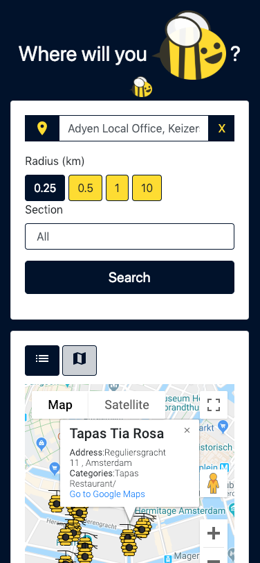

# Bee Out

A simple web application that uses the Foursquare API and provides some filters for searching points of interest.
The user can open the application [here. Bee Out](https://anadumitrache.github.io/bee-out/app/)

### Key features
* When the user enters the application a pop-up will ask for sharing location approval.
* If the user accepts the Adress filter will be filled with the user's current location, if not the address will be empty.
* The user can type into the address input and a dropdown with more place will be available (using Google Maps -> Place Autocomplete)
* The user can delete the address by pressing the X button near the address field.
* The user can choose a radius from the ones displayed.
* The user can choose a category from the section dropdown.
* When the user clicks search, all the filters are applied and a list with recommended places will be available in the following forms:
* * By default, the List View is selected, displaying the data using a table. Each row will display the name of the place, the categories and the distance to it (closest first). If the user selects a row, he will be redirected to Google Maps.
* * The user can click the Map View, and the map will be displayed. The center of the map will be the address that the user entered and the recommended places will have a marker. If the user clicks the place marker, he will be prompted some information about the place (info from Foursquare) and also a link to be redirected to the google maps page.
* If the API will not find any recommended place, the user will be displayed a message "No results."
* While retrieving the data from the Foursquare servers a spinner will be displayed.
* The user can use the application on Desktop or Mobile.

| Mobile | Desktop |
| --- | --- |
| |  | 
| |  | 

### Project structure
 

### Technical references
Framework used:
* Angular JS: https://code.angularjs.org/1.6.2/docs/guide

Foursquare API:
* Venues endpoint: https://developer.foursquare.com/docs/api/venues/explore
* Authentication: https://developer.foursquare.com/docs/api/configuration/authentication

Google Maps API:
* Map : https://developers.google.com/maps/documentation/javascript/tutorial
* Geolocation : https://developers.google.com/maps/documentation/javascript/geocoding
* Autocomplete : https://developers.google.com/maps/documentation/javascript/examples/places-autocomplete
* Markers: https://developers.google.com/maps/documentation/javascript/markers

Design:
* Bootstrap (4) CSS : https://getbootstrap.com
* Material Design Icons: https://material.io/tools/icons
* SVG created with: http://vectorpaint.yaks.co.nz/
* Bee Icon: https://pixabay.com/en/bee-black-buzz-cute-gray-grey-1295432/
* Hive Icon : https://www.flaticon.com/search?word=beehive 

